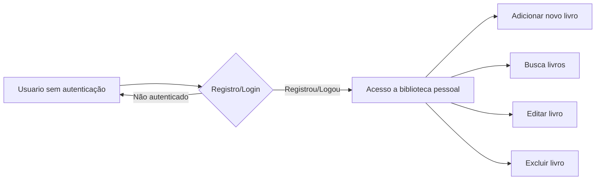

# Documentação de Build – Personal-library (.NET)

## Pré-requisitos

Antes de iniciar o build do projeto, certifique-se de ter os seguintes requisitos instalados:

- [.NET SDK](https://dotnet.microsoft.com/en-us/download)
- [Git](https://git-scm.com/)
- [Sql Server](https://www.microsoft.com/pt-br/sql-server/sql-server-downloads)

## Clonando o repositório

Para obter o código do projeto, execute:

```sh
git clone https://github.com/RodGama/Personal-library.git
cd Personal-library
```

### Estrutura do Projeto

Este repositório contém duas aplicações .NET. Certifique-se de navegar para os diretórios corretos antes de executar os comandos de build.

## Restaurando Dependências

Execute o comando abaixo na raiz do repositório ou nos diretórios específicos das aplicações:

```sh
dotnet restore
```

## Construindo o Projeto

Para compilar as aplicações, execute:

```sh
dotnet build
```

## Executando o Projeto

Antes de executar o projeto sera nescessário alterar a string de conexao com o banco de dados. Para isto altere o arquivo `appsettings.json`.

Para rodar uma das aplicações, navegue até o diretório raiz e execute:

```sh
//Rodando a interface MVC
dotnet run --project app.mvc/app.mvc.csproj
//Rodando a API RESTful
dotnet run --project app.webapi/api.host/api.host.csproj
```

Para acessar a aplicação MVC acesse: https://localhost:7215/

Para verificar a documentaçao da API RESTful acesse: https://localhost:7038/swagger/index.html

## Fluxograma

